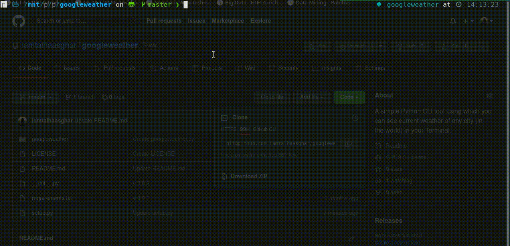

# googleweather
A simple Python CLI tool using which you can see current weather of any city (in the world) in your Terminal.

Cool part is, It doesn't complains or throws error if you enter incorrect city / country name but it automatically infers the city / country and shows you the output.

